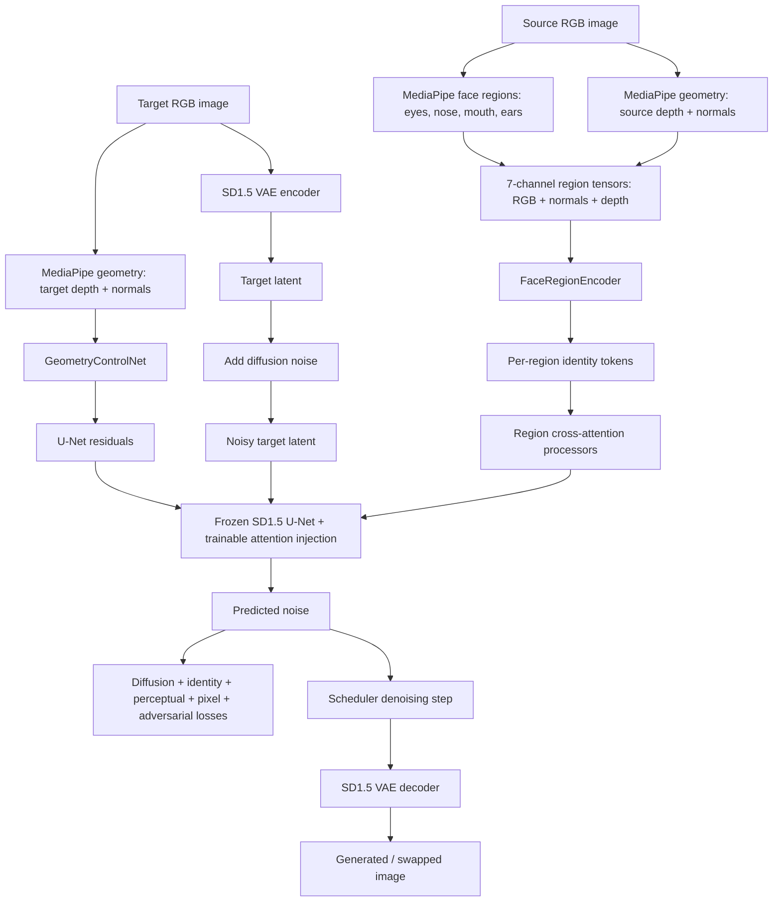

# System Architecture: Geometry-Aware Deepfake Generation via 3D Disentanglement

This document describes the current implementation in this repository:

`https://github.com/raghavujjwal/Geometry-aware-Deepfake-generation-via-3D-disentanglement`

The active system is a lightweight geometry-aware face-swap pipeline built around Stable Diffusion 1.5, MediaPipe Face Mesh geometry, region-disentangled identity encoders, and a ControlNet-style geometry branch. Older DECA/SDXL components are retained in backup or target-design paths, but the resource-constrained training path uses SD 1.5 and cached MediaPipe geometry.

## 1. High-Level Goal

Given:

- Source image `Is`: identity to transfer.
- Target image `It`: pose, expression, lighting, and scene context to preserve.

The system predicts:

- Output image `Ihat`: target-like image whose face should move toward the source identity while preserving target geometry.

The implemented training setup is closer to image-to-image conditional denoising than pure text-to-image generation. Target RGB is encoded into SD latent space, noise is added, and the U-Net learns to denoise under source identity and target geometry conditioning.

## 2. Major Runtime Modes

### 2.1 Geometry Cache Precomputation

Entry point:

- `face_swap/scripts/precompute_deca.py`

Despite the filename, the active implementation uses MediaPipe Face Mesh rather than DECA. It preserves the `.deca.pt` extension for compatibility with the rest of the codebase.

Input:

- Image paths from configured datasets.
- Config path such as `face_swap/configs/train_config_kaggle_t4.yaml`.

Output per image:

- `depth_map`: `(3, H, W)`
- `normal_map`: `(3, H, W)`
- `depth_map_raw`: `(1, H, W)`
- `param_embedding`: `(320,)`

The Kaggle path uses:

- `data.geometry_cache_dir`
- `data.geometry_cache_key_root`

These make the cache writable under `/kaggle/working` and portable across Kaggle mounts.

### 2.2 Training

Entry point:

- `face_swap/train.py`

Training orchestration:

- `face_swap/training/trainer.py`

Core trainable components:

- Region encoder input-fusion blocks, Transformer heads, and projection MLPs.
- IP-Adapter-style region cross-attention layers injected into SD1.5 U-Net attention blocks.
- Lightweight geometry ControlNet.
- Multi-scale PatchGAN discriminator.

Mostly frozen components:

- Stable Diffusion 1.5 U-Net base parameters.
- Stable Diffusion VAE.
- CLIP/text conditioning path through a cached null prompt embedding.
- ResNet-50 feature backbones inside region encoders.

### 2.3 Inference

Entry point:

- `face_swap/inference/pipeline.py`

The active inference path uses image-to-image denoising:

1. Encode target RGB to VAE latent.
2. Add noise according to `denoise_strength`.
3. Denoise using SD1.5 U-Net with:
   - source region identity tokens,
   - target depth/normal ControlNet residuals,
   - null text conditioning.
4. Decode latents to RGB.
5. Blend generated face region with the target image.

## 3. Repository Structure

```text
face_swap/
  train.py                         CLI training entry point
  configs/                         hardware and experiment configs
  data/
    dataset.py                     dataset indexing, pairing, dataloaders
    augmentations.py               image and crop transforms
  models/
    backbone.py                    SD1.5 VAE/U-Net wrapper and null text embeds
    region_encoder.py              per-region ResNet50 + Transformer + MLP
    cross_attention.py             IP-Adapter-style region attention injection
    geometry.py                    MediaPipe geometry extraction and cache loading
    controlnet.py                  lightweight geometry ControlNet residual branch
    discriminator.py               multi-scale PatchGAN discriminator
  losses/
    identity_loss.py               ArcFace-style identity loss wrapper
    perceptual_loss.py             VGG-19 perceptual loss
    geometry_loss.py               target-design geometry loss and pixel L1
  training/
    trainer.py                     model construction, train loop, validation, checkpoints
    scheduler.py                   AdamW parameter groups and LR schedulers
  inference/
    pipeline.py                    checkpoint loading and img2img inference
    postprocess.py                 face blending and color correction
  scripts/
    precompute_deca.py             MediaPipe geometry cache builder
    inspect_and_load_weights.py    region weight inspection utility
  utils/
    face_crop.py                   MediaPipe-based region cropper
    metrics.py                     SSIM, PSNR, FID, ArcFace, geometry metrics
    visualize.py                   grids and visual debugging
    weight_loader.py               region checkpoint loading/remapping
```

Supporting directories:

```text
decalib/                           retained DECA library code
face_swap/backup_deca/             older DECA-oriented implementation
pipeline/                          standalone preprocessing utilities
kaggle/                            notebook/cloud workflow assets
Doc/                               documentation assets
pretrained/                        local pretrained weights
```

## 4. End-to-End Data Flow



## 5. Component Architecture

### 5.1 Dataset and Dataloader

Main file:

- `face_swap/data/dataset.py`

Responsibilities:

- Supports CelebA, FFHQ, VGGFace2, and CelebA-HQ dataset layouts.
- Samples source-target image pairs from the same dataset.
- Applies paired image augmentation.
- Extracts source face region crops and bounding boxes.
- Returns image paths for geometry cache lookup.

Training batch structure:

```text
source_image:             (B, 3, H, W), normalized to [-1, 1]
target_image:             (B, 3, H, W), normalized to [-1, 1]
source_regions:           dict[region -> (B, 3, 64, 64)]
source_region_bboxes:     dict[region -> (B, 4)]
source_path:              list[str]
target_path:              list[str]
```

Kaggle stability note:

- `num_workers=0` is preferred for Kaggle because MediaPipe/OpenCV can crash inside multiprocessing dataloader workers.

### 5.2 Geometry Conditioning

Main file:

- `face_swap/models/geometry.py`

Active class:

- `GeometryConditioning`

Internal extractor:

- `MediaPipeMeshGeometry`

The geometry module returns:

```text
depth_map:       (B, 3, image_size, image_size)
normal_map:      (B, 3, image_size, image_size)
depth_map_raw:   (B, 1, image_size, image_size)
param_embedding: (B, 320)
codedict:        None
```

Implementation details:

- MediaPipe Face Mesh extracts facial landmarks.
- Landmark `z` values are normalized into a depth proxy.
- OpenCV convex hull masking and inpainting densify sparse landmarks.
- Normals are computed from finite differences over the depth proxy.
- If MediaPipe is missing or fails, a fallback luminance-derived depth map and zero embedding are returned.
- Cache files are read from `cache_dir` if configured, otherwise from legacy `<image>.deca.pt` paths.

Design constraint:

- This is a lightweight geometry proxy, not true DECA/FLAME 3DMM fitting.

### 5.3 Region Identity Encoder

Main file:

- `face_swap/models/region_encoder.py`

Core class:

- `FaceRegionEncoder`

Regions:

- eyes
- nose
- mouth
- ears

Per-region architecture:

```text
7-channel crop
  -> InputConvBlock, fuses RGB + normal + depth to 3 channels
  -> frozen ResNet-50 trunk
  -> adaptive spatial pooling to 4 tokens
  -> TransformerHead
  -> ProjectionMLP
  -> 4 identity tokens of dimension 512
```

Output:

```text
dict[region -> (B, 4, 512)]
```

Across four regions this produces 16 identity tokens total.

Pretrained region weights:

- Loaded via `face_swap/utils/weight_loader.py`.
- Supports multiple checkpoint layouts and heuristic key remapping.

### 5.4 Stable Diffusion 1.5 Backbone

Main file:

- `face_swap/models/backbone.py`

Core class:

- `FaceSwapBackbone`

Responsibilities:

- Loads SD1.5 U-Net.
- Loads SD1.5 VAE.
- Loads CLIP text encoder only long enough to cache null-prompt embeddings.
- Deletes text encoder after null embedding creation to reduce memory.
- Injects region-aware attention processors into U-Net attention layers.
- Provides helper methods:
  - `encode_images`
  - `decode_latents`
  - `encode_text`
  - `add_noise`
  - `attention_injection_parameters`

Trainability:

- U-Net base parameters are frozen.
- Attention injection parameters are trainable.
- VAE is frozen.
- Text encoder is not retained during training.

### 5.5 Region Cross-Attention Injection

Main file:

- `face_swap/models/cross_attention.py`

Core classes:

- `RegionCrossAttention`
- `MultiRegionCrossAttention`
- `IPAdapterRegionAttnProcessor`
- `RegionAttentionInjector`

Function:

- Adds an IP-Adapter-style cross-attention branch to U-Net attention blocks.
- Standard text cross-attention is preserved.
- Region identity context is added as a separate attention output.

Control knob:

- `region_attn_scale`

Inference note:

- Larger region attention scale may increase source influence, but can also destabilize image quality.

### 5.6 Geometry ControlNet

Main file:

- `face_swap/models/controlnet.py`

Core class:

- `GeometryControlNet`

Inputs:

```text
conditioning:    (B, 6, H/8, W/8)
param_embedding: (B, 320)
```

The 6 conditioning channels are:

```text
target depth replicated to 3 channels + target normal map with 3 channels
```

Outputs:

```text
down_block_res_samples: list of residual tensors matching SD1.5 down blocks
mid_block_res_sample:   residual tensor matching SD1.5 mid block
```

Architecture:

- Lightweight convolutional trunk.
- Geometry embedding MLP projects global landmark embedding.
- Zero-initialized `ZeroConv2d` output projections stabilize training.

### 5.7 Losses

Files:

- `face_swap/losses/identity_loss.py`
- `face_swap/losses/perceptual_loss.py`
- `face_swap/losses/geometry_loss.py`
- `face_swap/models/discriminator.py`

Active training losses:

```text
diffusion MSE:       predicts added noise in target latent space
identity loss:       ArcFace-style cosine loss between generated and source
perceptual loss:     VGG-19 multi-layer feature L1 between generated and target
pixel L1:            generated vs target
adversarial loss:    hinge generator/discriminator losses with PatchGAN
```

Geometry consistency loss exists, but the Kaggle T4 config disables it:

```text
geometry_consistency.weight = 0.0
```

This is an important reporting detail. The implemented lightweight run uses geometry as conditioning, not as an additional geometry-consistency loss.

### 5.8 Training Orchestrator

Main file:

- `face_swap/training/trainer.py`

Responsibilities:

- Parses YAML config.
- Builds models, losses, dataloaders, optimizers, and schedulers.
- Wraps models with Hugging Face Accelerate.
- Loads pretrained region weights.
- Loads/resumes checkpoints.
- Runs train loop.
- Logs losses.
- Saves trainable-only checkpoints.

Checkpoint contents:

```text
trainable_state.pt:
  global_step
  region_encoder
  controlnet
  discriminator
  gen_opt
  disc_opt
```

Frozen SD1.5 U-Net and VAE are not saved to avoid large checkpoints.

### 5.9 Inference Pipeline

Main file:

- `face_swap/inference/pipeline.py`

Core class:

- `FaceSwapPipeline`

Inference stages:

1. Load SD1.5 backbone.
2. Load trainable checkpoint state.
3. Move backbone, region encoder, and ControlNet to target device/dtype.
4. Compute source region identity features.
5. Compute target geometry ControlNet residuals.
6. Encode target image to latent.
7. Add noise based on `denoise_strength`.
8. DDIM denoise under region and geometry conditioning.
9. Decode latents.
10. Blend generated face with target background.

Important inference knobs:

```text
denoise_strength:    controls how much the target latent is modified
region_attn_scale:   controls source-region identity injection strength
blend_alpha:         controls face-region blending strength
guidance_scale:      should usually remain 1.0 for this implementation
```

Observed behavior:

- Low denoise strength preserves target quality but weakens source identity transfer.
- High denoise strength increases facial modification but can degrade realism.

## 6. Configuration Strategy

Important configs:

```text
face_swap/configs/train_config_kaggle_t4.yaml
face_swap/configs/train_config_l40s.yaml
face_swap/configs/train_config_a100.yaml
face_swap/configs/train_config_h100.yaml
```

Kaggle T4 profile:

```text
image_size: 256
batch_size: 1
gradient_accumulation_steps: 8
mixed_precision: fp16
controlnet.internal_channels: 64
num_workers: 0
geometry_cache_dir: /kaggle/working/geometry_cache
```

Path values must be patched per Kaggle account:

```text
data.datasets[0].root
data.geometry_cache_key_root
model.region_encoder.pretrained_weights.*
```

## 7. Cloud Workflow

### 7.1 First Training Run

Typical Kaggle sequence:

```bash
git clone https://github.com/raghavujjwal/Geometry-aware-Deepfake-generation-via-3D-disentanglement.git /kaggle/working/face_swap_3d
cd /kaggle/working/face_swap_3d
pip install diffusers transformers accelerate safetensors mediapipe opencv-python-headless scikit-image kornia yacs imageio tqdm rich
python face_swap/scripts/precompute_deca.py --config face_swap/configs/train_config_kaggle_t4.yaml --split train --batch_size 8
CUDA_VISIBLE_DEVICES=0 python face_swap/train.py --config face_swap/configs/train_config_kaggle_t4.yaml --steps 5000
```

### 7.2 Resume Training

If a checkpoint exists:

```bash
CUDA_VISIBLE_DEVICES=0 python face_swap/train.py \
  --config face_swap/configs/train_config_kaggle_t4.yaml \
  --steps 10000 \
  --resume /kaggle/working/outputs_t4/checkpoint-5000
```

`--steps 10000` means train until global step 10000. If the checkpoint is at step 5000, this adds 5000 more steps.

### 7.3 Artifact Preservation

Minimum artifacts to save:

```text
outputs_t4/checkpoint-5000/
train_config_kaggle_t4_final.yaml
inference_grid_checkpoint_5000.png
inference_samples/
geometry_cache_5k.tar.gz, if storage allows
```

Recommended external storage:

- Hugging Face model repository for checkpoints and samples.
- Kaggle Save Version for notebook and output state.

## 8. Known Limitations

### 8.1 Target Reconstruction Shortcut

The model is trained using noisy target latents. This gives a strong path to reconstruct the target face. If source identity conditioning is weak, outputs remain close to the target identity.

### 8.2 Lightweight Geometry Proxy

MediaPipe Face Mesh is fast and cheap, but it is not equivalent to DECA or FLAME 3DMM coefficients. It can fail under:

- profile views,
- occlusions,
- heavy blur,
- unusual lighting,
- extreme expressions.

### 8.3 Short Training Runs

The 5k-step Kaggle T4 run is useful for feasibility and debugging but is not sufficient evidence of final face-swap quality. Longer training may improve stability and source transfer, but identity transfer may also require loss rebalancing.

### 8.4 Identity Loss Dependency

ArcFace identity quality depends on the actual model loaded by `identity_loss.py`. If the intended ArcFace model is unavailable, fallback behavior may weaken the identity signal.

## 9. Meaningful Work Division for 4 People

The implementation should be divided by system boundaries, not by line count. Each person should own a coherent subsystem, its tests, documentation, and failure modes.

### Person 1: Data, Geometry, and Cache Pipeline

Primary ownership:

- Dataset setup and path handling.
- MediaPipe Face Mesh geometry.
- Depth and normal map generation.
- Geometry cache creation and reuse.
- Kaggle portability.

Main files:

```text
face_swap/data/dataset.py
face_swap/data/augmentations.py
face_swap/models/geometry.py
face_swap/scripts/precompute_deca.py
face_swap/utils/face_crop.py
```

Expected deliverables:

- Verified CelebA loading on Kaggle and local paths.
- Geometry cache smoke test and full precompute run.
- Documentation of cache format.
- Failure-mode notes for MediaPipe geometry.

Suggested contribution statement:

```text
Implemented the dataset ingestion and lightweight MediaPipe geometry cache pipeline, including depth/normal proxy generation and Kaggle-compatible cache reuse.
```

### Person 2: Model Architecture and Conditioning

Primary ownership:

- SD1.5 backbone wrapper.
- Region-disentangled identity encoder.
- Region attention injection.
- Geometry ControlNet branch.

Main files:

```text
face_swap/models/backbone.py
face_swap/models/region_encoder.py
face_swap/models/cross_attention.py
face_swap/models/controlnet.py
```

Expected deliverables:

- Architecture diagram.
- Shape contract table for each module.
- Verified forward pass for backbone, ControlNet, and region encoder.
- Explanation of trainable vs frozen parameters.

Suggested contribution statement:

```text
Designed and implemented the SD1.5-based architecture with region-disentangled identity encoding, IP-Adapter-style cross-attention injection, and a lightweight geometry ControlNet.
```

### Person 3: Training, Losses, and Checkpointing

Primary ownership:

- Training loop.
- Loss integration.
- Optimizer/scheduler setup.
- Mixed precision and Accelerate.
- Checkpoint save/resume.
- Cloud training execution.

Main files:

```text
face_swap/train.py
face_swap/training/trainer.py
face_swap/training/scheduler.py
face_swap/losses/identity_loss.py
face_swap/losses/perceptual_loss.py
face_swap/losses/geometry_loss.py
face_swap/models/discriminator.py
face_swap/configs/*.yaml
```

Expected deliverables:

- Stable training command for Kaggle/L40S/A100.
- Checkpoint resume test from step 5000.
- Training logs and loss curves.
- Hugging Face artifact upload instructions.

Suggested contribution statement:

```text
Implemented and executed the end-to-end training system, including mixed-precision training, loss scheduling, checkpointing, resume support, and cloud artifact management.
```

### Person 4: Inference, Evaluation, and Result Packaging

Primary ownership:

- Inference pipeline.
- Post-processing.
- Qualitative grids.
- Metric computation.
- Benchmark scripts.
- Paper-ready figures and tables.

Main files:

```text
face_swap/inference/pipeline.py
face_swap/inference/postprocess.py
face_swap/utils/metrics.py
face_swap/utils/visualize.py
```

Expected deliverables:

- Reproducible inference notebook/cell.
- Parameter sweep for `denoise_strength`, `blend_alpha`, and `region_attn_scale`.
- Side-by-side source/target/swap qualitative grids.
- Quantitative benchmark table.
- Final artifact archive.

Suggested contribution statement:

```text
Implemented the inference and evaluation workflow, including checkpoint loading, img2img denoising, qualitative visualization, parameter sweeps, and metric reporting.
```

## 10. Integration Contract Between People

Each subsystem owner should publish a small contract:

```text
Inputs:
Outputs:
Tensor shapes:
Config keys:
Expected files:
Known failure modes:
Smoke test command:
```

Example geometry contract:

```text
Input:
  image tensor (B, 3, H, W), normalized to [-1, 1]

Output:
  depth_map       (B, 3, 256, 256)
  normal_map      (B, 3, 256, 256)
  depth_map_raw   (B, 1, 256, 256)
  param_embedding (B, 320)

Smoke test:
  python face_swap/scripts/precompute_deca.py --config face_swap/configs/train_config_kaggle_t4.yaml --split train --batch_size 8 --max_images 64
```

## 11. Benchmarking Plan

Benchmark the architecture in three layers: system performance, image quality, and ablations.

### 11.1 System Performance Benchmarks

Measure:

- Geometry cache time for 64, 1000, and 5000 images.
- Training time per 500 steps.
- GPU memory usage during training.
- Inference latency per image pair.
- Checkpoint size.

Commands:

```bash
nvidia-smi
python face_swap/scripts/precompute_deca.py --config face_swap/configs/train_config_kaggle_t4.yaml --split train --batch_size 8 --max_images 64
CUDA_VISIBLE_DEVICES=0 python face_swap/train.py --config face_swap/configs/train_config_kaggle_t4.yaml --steps 500
```

Report:

```text
hardware
VRAM
RAM
batch size
gradient accumulation
steps/sec
minutes per 500 steps
```

### 11.2 Qualitative Benchmarks

Use fixed source-target pairs across all checkpoints and ablations.

Recommended qualitative grid:

```text
source | target | output
```

Run the same pairs for:

- checkpoint-5000
- checkpoint-7500, if available
- checkpoint-10000, if available
- no-geometry variant, if available
- no-region-attention variant, if available

Keep inference settings fixed:

```text
num_inference_steps = 20 or 25
guidance_scale = 1.0
denoise_strength = 0.25 or 0.30
blend_alpha = 0.65
region_attn_scale = 1.0
```

### 11.3 Quantitative Benchmarks

Metrics available in `face_swap/utils/metrics.py`:

- SSIM: output vs target.
- PSNR: output vs target.
- FID: output distribution vs target/real distribution.
- ArcFace similarity: output vs source.
- Landmark/geometry error: output vs target, if geometry module supports the required landmarks.

Recommended minimum benchmark set:

```text
100 fixed CelebA source-target pairs for quick iteration
500 fixed CelebA source-target pairs for final table
```

Report metrics with standard settings:

```text
ArcFace similarity higher is better.
SSIM higher is better.
PSNR higher is better.
FID lower is better.
Landmark error lower is better.
```

### 11.4 Ablation Benchmarks

Useful ablations:

```text
Full model
No target geometry ControlNet
No region identity tokens
RGB-only region encoder, no depth/normal crops
Lower denoise_strength
Higher region_attn_scale
Checkpoint-5000 vs checkpoint-7500 vs checkpoint-10000
```

For a deadline-friendly ablation, compare:

```text
checkpoint-5000 at denoise_strength 0.15, 0.25, 0.35, 0.45
```

This documents the tradeoff between target preservation and identity modification without needing another training run.

### 11.5 Benchmark Acceptance Criteria

A usable benchmark report should include:

- Exact Git commit.
- Exact checkpoint path.
- Exact config YAML.
- Hardware and runtime.
- Number of source-target pairs.
- Fixed inference parameters.
- Metric table.
- Qualitative grid.
- Failure cases.

Do not report baseline comparison numbers unless the baselines were actually run under the same image resolution, pair list, and metric implementation.

